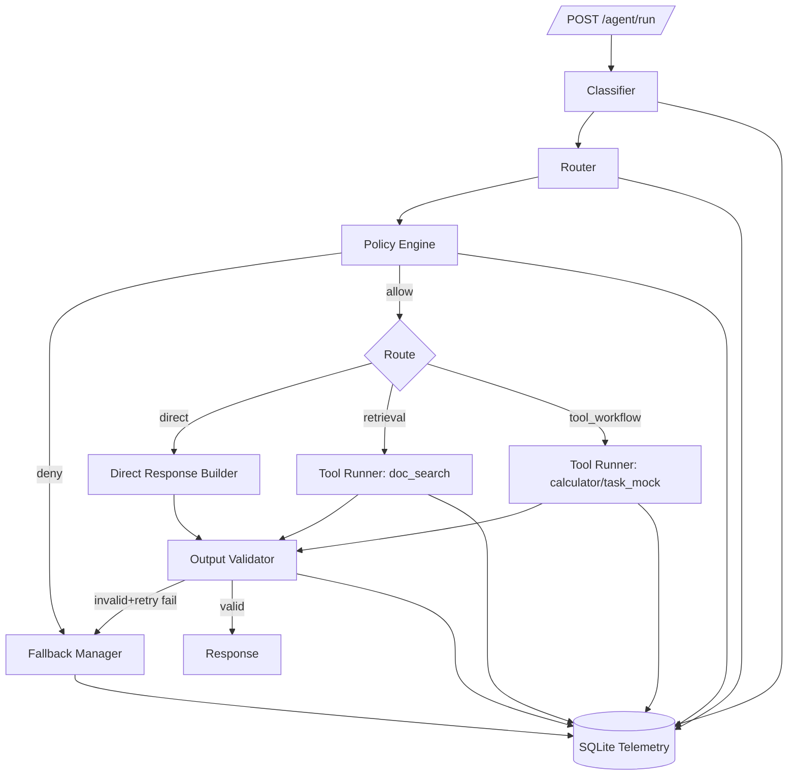

# Agent Guardrails + Orchestration Starter

Production-style FastAPI scaffold for a local-only (zero API cost) agent system with policy guardrails, tool controls, structured-output validation, fallback behavior, and SQLite audit telemetry.

## Stack
- Python + FastAPI
- SQLite audit/event store
- Local tools only
- Optional local LLM classification via Ollama (`config/settings.yaml`)

## Project Structure
```text
app/
  api/
    routes_agent.py
    routes_health.py
  core/
    classifier.py
    router.py
    policy_engine.py
    tool_runner.py
    output_validator.py
    fallback_manager.py
    orchestrator.py
    settings.py
  telemetry/
    db.py
    events.py
  tools/
    doc_search.py
    calculator.py
    task_mock.py
config/
  policies.yaml
  settings.yaml
  output_schema.json
data/
  corpus/*.md
scripts/
  reliability_harness.py
  benchmark_scenarios.json
  metrics_report.py
tests/
  test_policies.py
  test_reliability.py
```

## Architecture Diagram


## Setup (Windows PowerShell)
```powershell
python -m venv .venv
.\.venv\Scripts\Activate.ps1
pip install -r requirements.txt
```

## Run API
```powershell
uvicorn app.main:app --reload
```

Expected startup snippet:
```text
INFO:     Uvicorn running on http://127.0.0.1:8000
```

## Quick Endpoint Checks
```powershell
curl http://127.0.0.1:8000/health
curl http://127.0.0.1:8000/agent/policies
```

Expected `/health` snippet:
```json
{"status":"ok"}
```

## Tests
```powershell
pytest -q
```

Expected snippet:
```text
7 passed
```

## Reliability Harness
```powershell
python scripts/reliability_harness.py
```

Writes `data/reliability_report.json`.

## Metrics Report
```powershell
python scripts/metrics_report.py
```

Writes `data/metrics_summary.json` with:
- `policy_precision_proxy`
- `policy_recall_proxy`
- `blocked_unsafe_actions_count`
- `task_success_rate`
- `fallback_activation_rate`

## API Endpoints
- `POST /agent/run`
- `GET /agent/policies`
- `GET /agent/incidents`
- `GET /health`

## Replace These Placeholders
- Policies: edit `config/policies.yaml`
  - Replace keyword lists, risk caps, and intent-to-tool mapping with your real policy.
- Tools: extend `app/tools/` and register in `app/core/tool_runner.py`
  - Replace mock `task_mock` behavior with real local workflow logic.
- Classifier behavior: tune `app/core/classifier.py`
  - Replace heuristics with stronger local model prompts/rubrics.
- Benchmark scenarios: update `scripts/benchmark_scenarios.json`
  - Replace starter scenarios with your own domain-safe and adversarial set.
- Corpus: replace `data/corpus/*.md`
  - Add realistic local docs for retrieval benchmarking.

## Tradeoffs (Minimal Dependency Design)
- Heuristic-first classification is deterministic and cheap, but less nuanced than stronger local model setups.
- SQLite telemetry is local and portable, but not intended for high-write distributed systems.
- JSON schema enforcement improves safety; strict schemas can increase fallback rate until prompts/tool outputs are tuned.
